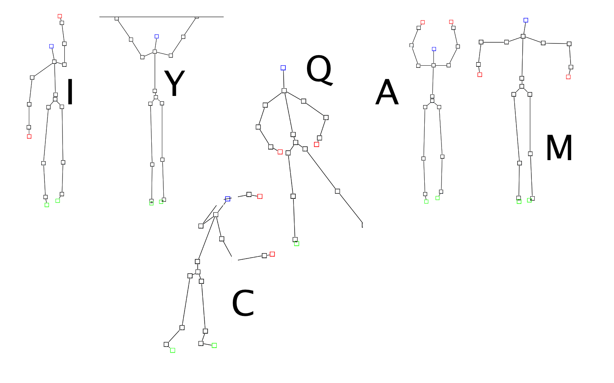

# Jnect IncQuery Demo

This is a demo to be used with the [Jnect framework](http://code.google.com/a/eclipselabs.org/p/jnect/). It demonstrates the usage of EMF-IncQuery graph patterns as "standing queries" (live queries) over a live EMF model (called BodyModel) that is maintained in sync with the user's body by the Kinect sensor. IncQuery queries may be used for real-time gesture recognition (using delta monitors).

## Howto

### Jnect modifications

For the IncQuery demo, some modifications to Jnect are required. 
*TODO* details and patch soon to follow 

A quick summary of necessary changes:
 - modify bodymodel.ecore (links should be a containment)
 - modify plugin.xml, fix genmodel reference
 - fix GEF demo: HumanContainerEditpart

My additions:
 - new commands to stop GEF demo
 - a new Body Provider that sets up coordinates properly
 - a demo Kinect Manager impl class
  - provides dummy implementations for Kinectless development
  - handles the simulation loop 
  
### Trying the demo

General advice: use the Quick Access bar in Eclipse, as all user actions are to be invoked through Eclipse Commands.

Commands
 - "Start Kinect GEF demo": be sure to have opened a(n empty) .humanbodymodel file beforehand (this will open the Kinect GEF Demo Editor)
  - this command will load the default body into the system, as well as start the simulation loop
 - "Start Kinect IncQuery demo": this will initialize the simple live queries on the live body model
 - "Start Kinect YMCA Demo": this will initialize the live queries of the YMCA example on the live body model
 - "Save Kinect Bodymodel": for debugging purposes, this will save a demomodel.xmi file into the bodymodel.incquery project in your workspace (overriding anything that may be there already)
 - "Stop Kinect GEF demo": stop the simulation loop
 
### YMCA Gestures
 

The YMCA Example is about detecting some letters of the alphabet as gestures. The following letters are supported:
- Y: both arms stretched above the head, the upper arms enclosing an angle of about 60 degrees
- M: both arms bent (at about a right angle, that is 90 degrees), both hands below the head, the hands at a considerable distance from each other
- C: both arms bent, left hand above the head while right hand below (you should attempt to perform this gesture quickly, as the Kinect sensor may have some difficulty in tracking this gesture)
- A: both arms bent above the head with the hands touching
- I: right arm streched straight above the head
- Q: both arms bent below the head with the hands touching, the feet at a considerable distance from each other   
 
## How it works

Coming soon. 